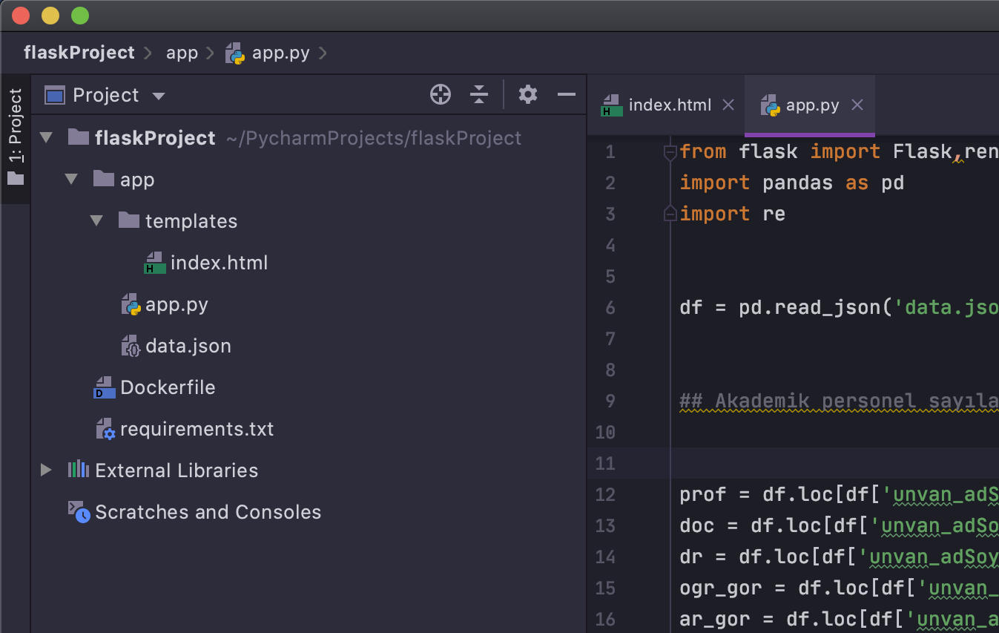
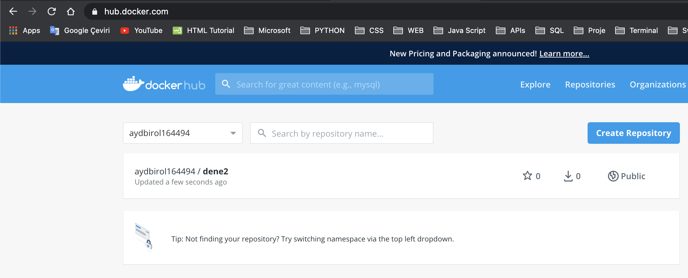

# docker_python
Creating images in Docker using Python, Flask Web App, and Pandas

- You can try with source code

# Image creation steps

- PyCharm ile New Project

- Choose Flask application , Existing interpreter


- CREATE


- Flask Project Folder


- flaskProject/app  , create

- app/app.py  , create


``` Python
    #app/app.py

    from flask import Flask,render_template
    import pandas as pd
    import re


    # Python codes .......................
    # ....................................


    app = Flask(__name__)

    @app.route('/')
    def hello_world():
        return render_template('index.html',data = data)


    if __name__ == '__main__':
        app.run(host='0.0.0.0',port=5000)

```


- app/data.json , create

- app/templates/index.html ,create

- flaskProject/Dockerfile , create


- flaskProject/requirements.txt ,create


``` text
    #requirements.txt

    click==7.1.2
    Flask==1.1.2
    Jinja2==2.11.2
    MarkupSafe==1.1.1
    pip==20.2.1
    Werkzeug==1.0.1
    pandas==1.1.0


```

Project folder




- Acknowledging that Docker is preinstalled 


- We create a docker image named dene2

``` sh

    docker build -t dene2:latest .

```


- We create a docker image named flask


``` sh

    docker run -p 5000:5000 dene2

```


- With CMD + LEFT CLICK we can go to the web page


- Now we can send our created flask application container to our storage area on the docker hub.

- We copy a new image with the same image ID using the 'docker image tag dene2 aydbirol164494/dene2' command.
  

``` sh

    docker image tag dene2 aydbirol164494/dene2

```

- Using the ' docker push aydbirol164494/dene2 ' command, we now send this image file we created to our storage area on the docker hub.



- With our control, we can see the 'aydbirol164494/dene2' image file on the docker hub at the same time.

- In order to test whether we can create a container by downloading the new image file from the hub, we first delete the 'aydbirol164494/dene2' image file using the docker image rm -f 447fafafb619 command.

``` sh

    docker image rm -f 447fafafb619 

```


- Again, we must run the command 'docker container run --rm --publish 5000: 5000 aydbirol164494/dene2' and download the image file from the docker hub and use this image to raise our container. We can examine this process from the picture below.

``` sh

    docker container run --rm --publish 5000:5000 aydbirol164494/dene2

```


- We have learned a brief information about how to create an image file, how to configure and run the Dockerfile file, how to set up containers over the image, and how to use the docker hub.